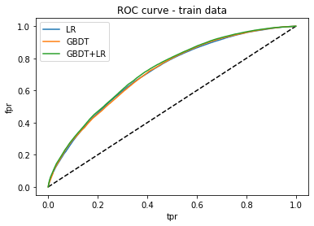
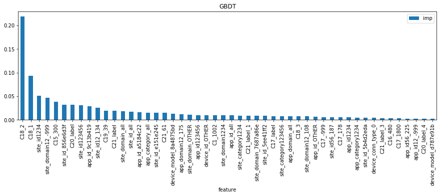
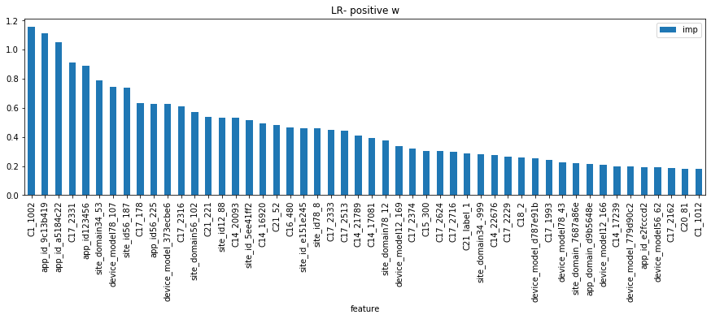
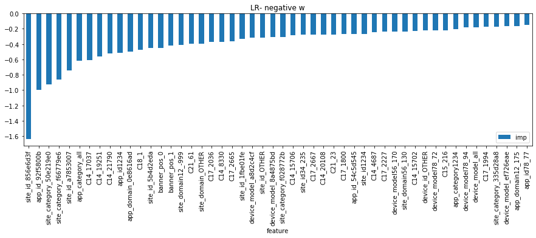
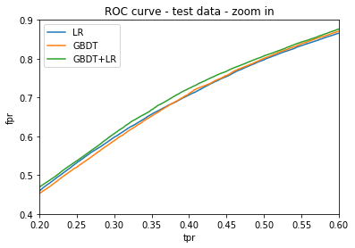

### Refresher on evaluation metrics:
* Accuracy
* Recall
* Confusion matrix
* ROC 
* AUC 
* Logloss

AUC vs. Logloss
Logloss evaluates model's predictive power, while AUC emphaizes model's ability to rank.

### Load data and trained models


```python
import pickle
```


```python
# load models
model_lr = pickle.load(open('model_lr.pkl','rb'))
model_grd = pickle.load(open('grd.pkl','rb'))
model_grd_enc = pickle.load(open('grd_enc.pkl','rb'))
model_grd_lm= pickle.load(open('grd_lm.pkl','rb'))
```


```python
# load data
train_X = pickle.load(open('train_X.pkl','rb'))
train_y = pickle.load(open('train_y.pkl','rb'))
test_X = pickle.load(open('test_X.pkl','rb'))
test_y = pickle.load(open('test_y.pkl','rb'))
```


```python
# data description
train_X.shape, train_y.shape
test_X.shape,test_y.shape
```


    ((534223, 548), (534223,))


    ((286626, 548), (286626,))


```python
train_X.head()
```


<div>
<style scoped>
    .dataframe tbody tr th:only-of-type {
        vertical-align: middle;
    }

    .dataframe tbody tr th {
        vertical-align: top;
    }

    .dataframe thead th {
        text-align: right;
    }
</style>
<table border="1" class="dataframe">
  <thead>
    <tr style="text-align: right;">
      <th></th>
      <th>weekend</th>
      <th>C20_label</th>
      <th>C17_label</th>
      <th>C19_label</th>
      <th>C21_label</th>
      <th>site_id1234</th>
      <th>site_id123456</th>
      <th>site_id_all</th>
      <th>site_domain1234</th>
      <th>site_domain_all</th>
      <th>...</th>
      <th>C17_label_1</th>
      <th>C17_label_2</th>
      <th>C17_label_3</th>
      <th>C17_label_4</th>
      <th>C19_label_3</th>
      <th>C19_label_4</th>
      <th>C21_label_1</th>
      <th>C21_label_2</th>
      <th>C21_label_3</th>
      <th>C21_label_4</th>
    </tr>
    <tr>
      <th>id</th>
      <th></th>
      <th></th>
      <th></th>
      <th></th>
      <th></th>
      <th></th>
      <th></th>
      <th></th>
      <th></th>
      <th></th>
      <th></th>
      <th></th>
      <th></th>
      <th></th>
      <th></th>
      <th></th>
      <th></th>
      <th></th>
      <th></th>
      <th></th>
      <th></th>
    </tr>
  </thead>
  <tbody>
    <tr>
      <th>8181827768660016329</th>
      <td>0</td>
      <td>1</td>
      <td>2</td>
      <td>1</td>
      <td>2</td>
      <td>0.235860</td>
      <td>0.240617</td>
      <td>0.203364</td>
      <td>0.320782</td>
      <td>0.130076</td>
      <td>...</td>
      <td>0</td>
      <td>1</td>
      <td>0</td>
      <td>0</td>
      <td>0</td>
      <td>0</td>
      <td>0</td>
      <td>1</td>
      <td>0</td>
      <td>0</td>
    </tr>
    <tr>
      <th>12798235348290719618</th>
      <td>0</td>
      <td>2</td>
      <td>4</td>
      <td>4</td>
      <td>4</td>
      <td>0.751854</td>
      <td>0.650900</td>
      <td>0.533642</td>
      <td>0.045982</td>
      <td>0.010297</td>
      <td>...</td>
      <td>0</td>
      <td>0</td>
      <td>0</td>
      <td>1</td>
      <td>0</td>
      <td>1</td>
      <td>0</td>
      <td>0</td>
      <td>0</td>
      <td>1</td>
    </tr>
    <tr>
      <th>3584922264180734473</th>
      <td>0</td>
      <td>1</td>
      <td>3</td>
      <td>1</td>
      <td>4</td>
      <td>0.509039</td>
      <td>0.178892</td>
      <td>0.229967</td>
      <td>0.695546</td>
      <td>0.409756</td>
      <td>...</td>
      <td>0</td>
      <td>0</td>
      <td>1</td>
      <td>0</td>
      <td>0</td>
      <td>0</td>
      <td>0</td>
      <td>0</td>
      <td>0</td>
      <td>1</td>
    </tr>
    <tr>
      <th>17228348737197528261</th>
      <td>0</td>
      <td>4</td>
      <td>1</td>
      <td>4</td>
      <td>3</td>
      <td>0.509039</td>
      <td>0.178892</td>
      <td>0.229967</td>
      <td>0.695546</td>
      <td>0.409756</td>
      <td>...</td>
      <td>1</td>
      <td>0</td>
      <td>0</td>
      <td>0</td>
      <td>0</td>
      <td>1</td>
      <td>0</td>
      <td>0</td>
      <td>1</td>
      <td>0</td>
    </tr>
    <tr>
      <th>11691376599615146203</th>
      <td>1</td>
      <td>4</td>
      <td>3</td>
      <td>3</td>
      <td>3</td>
      <td>0.509039</td>
      <td>0.178892</td>
      <td>0.229967</td>
      <td>0.695546</td>
      <td>0.409756</td>
      <td>...</td>
      <td>0</td>
      <td>0</td>
      <td>1</td>
      <td>0</td>
      <td>1</td>
      <td>0</td>
      <td>0</td>
      <td>0</td>
      <td>1</td>
      <td>0</td>
    </tr>
  </tbody>
</table>
<p>5 rows × 548 columns</p>
</div>


### Model evaluations - training set


```python
def calc_preds(test_X):
    """predictions """
    # set sample fraction due to negative down sampling
    w = .16/(1-.16)  

    def scale_pred(x,w):
        return x/(x+(1-x)/w)
    
    print('calc lr')
    pred_lr = scale_pred(model_lr.predict_proba(test_X)[:,1],w)
    print('calc gbt')
    pred_grd = scale_pred(model_grd.predict_proba(test_X)[:,1],w)
    print('calc gbt_lr')
    pred_grd_lm = model_grd_lm.predict_proba(model_grd_enc.transform(model_grd.apply(test_X)[:,:,0]))[:,1]
    pred_grd_lm = scale_pred(pred_grd_lm,w)

    return [pred_lr,pred_grd,pred_grd_lm]

```


```python
# evaluate fits - accuracy, recall, confusion_matrix, roc curve, log_loss
from sklearn.metrics import log_loss, confusion_matrix, accuracy_score, recall_score
from sklearn.metrics import roc_auc_score,roc_curve

def calc_metrics(test_y,pred_y):
    """calcualate metrics"""
    pred_y_ = [1 if x >=.5 else 0 for x in pred_y]  # lables for classification

    logloss = log_loss(test_y, pred_y)

    accuracy = accuracy_score(test_y,pred_y_)
    recall = recall_score(test_y,pred_y_)
    conf_mat = confusion_matrix(test_y,pred_y_)

    auc = roc_auc_score(test_y,pred_y)

    fpr,tpr,threshold = roc_curve(test_y,pred_y)

    return {'accuracy':accuracy,'recall':recall,'auc':auc,'logloss':logloss},conf_mat,[fpr,tpr]
```


```python
preds = calc_preds(train_X)
metrics_lr,conf_mat_lr,roc_lr = calc_metrics(train_y,preds[0])
metrics_grd,conf_mat_grd,roc_grd = calc_metrics(train_y,preds[1])
metrics_grd_lm,conf_mat_grd_lm,roc_grd_lm = calc_metrics(train_y,preds[2])
```


```python
import pandas as pd
pd.DataFrame([metrics_lr,metrics_grd,metrics_grd_lm],index=['lr','gbt','gbt_lr'])

print('confusion matrix LR:')
conf_mat_lr
print('confusion matrix GBDT:')
conf_mat_grd
print('confusion matrix GBDT_LR:')
conf_mat_grd_lm
```


<div>
<style scoped>
    .dataframe tbody tr th:only-of-type {
        vertical-align: middle;
    }

    .dataframe tbody tr th {
        vertical-align: top;
    }

    .dataframe thead th {
        text-align: right;
    }
</style>
<table border="1" class="dataframe">
  <thead>
    <tr style="text-align: right;">
      <th></th>
      <th>accuracy</th>
      <th>auc</th>
      <th>logloss</th>
      <th>recall</th>
    </tr>
  </thead>
  <tbody>
    <tr>
      <th>lr</th>
      <td>0.512005</td>
      <td>0.713245</td>
      <td>0.872164</td>
      <td>0.028490</td>
    </tr>
    <tr>
      <th>gbt</th>
      <td>0.502202</td>
      <td>0.714390</td>
      <td>0.906384</td>
      <td>0.004415</td>
    </tr>
    <tr>
      <th>gbt_lr</th>
      <td>0.513901</td>
      <td>0.722533</td>
      <td>0.898634</td>
      <td>0.031062</td>
    </tr>
  </tbody>
</table>
</div>


    confusion matrix LR:
    


    array([[265917,   1261],
           [259437,   7608]], dtype=int64)


    confusion matrix GBDT:
    


    array([[267109,     69],
           [265866,   1179]], dtype=int64)


    confusion matrix GBDT_LR:
    


    array([[266243,    935],
           [258750,   8295]], dtype=int64)


```python
import matplotlib.pyplot as plt
%matplotlib inline
plt.figure(1)
plt.plot([0,1],[0,1],'k--')
plt.plot(roc_lr[0],roc_lr[1],label='LR')
plt.plot(roc_grd[0],roc_grd[1],label='GBDT')
plt.plot(roc_grd_lm[0],roc_grd_lm[1],label='GBDT+LR')
plt.xlabel('tpr')
plt.ylabel('fpr')
plt.title('ROC curve - train data')
plt.legend(loc='best')
plt.show()

plt.figure(1)
plt.xlim((.2,.6))
plt.ylim((.4,.9))
plt.plot(roc_lr[0],roc_lr[1],label='LR')
plt.plot(roc_grd[0],roc_grd[1],label='GBDT')
plt.plot(roc_grd_lm[0],roc_grd_lm[1],label='GBDT+LR')
plt.xlabel('tpr')
plt.ylabel('fpr')
plt.title('ROC curve - train data - zoom in')
plt.legend(loc='best')
plt.show()
```


    <Figure size 432x288 with 0 Axes>


    [<matplotlib.lines.Line2D at 0x1e53b05f5f8>]


    [<matplotlib.lines.Line2D at 0x1e53b05f748>]


    [<matplotlib.lines.Line2D at 0x1e53b05f9b0>]


    [<matplotlib.lines.Line2D at 0x1e53b05fb70>]


    Text(0.5, 0, 'tpr')


    Text(0, 0.5, 'fpr')


    Text(0.5, 1.0, 'ROC curve - train data')


    <matplotlib.legend.Legend at 0x1e53b025d30>





    <Figure size 432x288 with 0 Axes>


    (0.2, 0.6)


    (0.4, 0.9)


    [<matplotlib.lines.Line2D at 0x1e539c59470>]


    [<matplotlib.lines.Line2D at 0x1e539c59358>]


    [<matplotlib.lines.Line2D at 0x1e539d95160>]


    Text(0.5, 0, 'tpr')


    Text(0, 0.5, 'fpr')


    Text(0.5, 1.0, 'ROC curve - train data - zoom in')


    <matplotlib.legend.Legend at 0x1e539c64c50>


### Model Check - weights and features


```python
def analyse_clf(clf,fea,model=''):
    if model=='GBDT':
        fea_imp = pd.DataFrame([fea,clf.feature_importances_]).T
        fea_imp.columns = ['feature','imp']
        fea_imp = fea_imp[fea_imp['imp']!=0]
        fea_imp[fea_imp['imp']>0].sort_values('imp',ascending=False).set_index('feature').head(50).plot(kind='bar',title=model,figsize=(15,4))
        
    if model=='LR':
        fea_imp = pd.DataFrame([train_X.columns,model_lr.coef_[0]]).T
        fea_imp.columns = ['feature','imp']
        fea_imp
        fea_imp = fea_imp[fea_imp['imp']!=0]
        fea_imp[fea_imp['imp']>0].sort_values('imp',ascending=False).set_index('feature').head(50).plot(kind='bar',title=model+'- positive w',figsize=(15,4))
        fea_imp[fea_imp['imp']<0].sort_values('imp',ascending=True).set_index('feature').head(50).plot(kind='bar',title=model+'- negative w',figsize=(15,4))
    
analyse_clf(model_grd,train_X.columns,'GBDT')
analyse_clf(model_lr,train_X.columns,'LR')
```











How's feature importance in GBDT? How to compare with LR?

### Model evaluations - test set


```python
preds = calc_preds(test_X)
metrics_lr,conf_mat_lr,roc_lr = calc_metrics(test_y,preds[0])
metrics_grd,conf_mat_grd,roc_grd = calc_metrics(test_y,preds[1])
metrics_grd_lm,conf_mat_grd_lm,roc_grd_lm = calc_metrics(test_y,preds[2])
```


```python
import pandas as pd
pd.DataFrame([metrics_lr,metrics_grd,metrics_grd_lm],index=['lr','gbt','gbt_lr'])

print('confusion matrix LR:')
conf_mat_lr
print('confusion matrix GBDT:')
conf_mat_grd
print('confusion matrix GBDT_LR:')
conf_mat_grd_lm
```


<div>
<style scoped>
    .dataframe tbody tr th:only-of-type {
        vertical-align: middle;
    }

    .dataframe tbody tr th {
        vertical-align: top;
    }

    .dataframe thead th {
        text-align: right;
    }
</style>
<table border="1" class="dataframe">
  <thead>
    <tr style="text-align: right;">
      <th></th>
      <th>accuracy</th>
      <th>auc</th>
      <th>logloss</th>
      <th>recall</th>
    </tr>
  </thead>
  <tbody>
    <tr>
      <th>lr</th>
      <td>0.848566</td>
      <td>0.711747</td>
      <td>0.389865</td>
      <td>0.031035</td>
    </tr>
    <tr>
      <th>gbt</th>
      <td>0.848311</td>
      <td>0.712800</td>
      <td>0.389059</td>
      <td>0.004611</td>
    </tr>
    <tr>
      <th>gbt_lr</th>
      <td>0.849801</td>
      <td>0.720873</td>
      <td>0.386660</td>
      <td>0.031448</td>
    </tr>
  </tbody>
</table>
</div>


    confusion matrix LR:
    


    array([[241868,   1162],
           [ 42243,   1353]], dtype=int64)


    confusion matrix GBDT:
    


    array([[242947,     83],
           [ 43395,    201]], dtype=int64)


    confusion matrix GBDT_LR:
    


    array([[242204,    826],
           [ 42225,   1371]], dtype=int64)


```python
import matplotlib.pyplot as plt
%matplotlib inline
plt.figure(1)
plt.plot([0,1],[0,1],'k--')
plt.plot(roc_lr[0],roc_lr[1],label='LR')
plt.plot(roc_grd[0],roc_grd[1],label='GBDT')
plt.plot(roc_grd_lm[0],roc_grd_lm[1],label='GBDT+LR')
plt.xlabel('tpr')
plt.ylabel('fpr')
plt.title('ROC curve - test data')
plt.legend(loc='best')
plt.show()

plt.figure(1)
plt.xlim((.2,.6))
plt.ylim((.4,.9))
plt.plot(roc_lr[0],roc_lr[1],label='LR')
plt.plot(roc_grd[0],roc_grd[1],label='GBDT')
plt.plot(roc_grd_lm[0],roc_grd_lm[1],label='GBDT+LR')
plt.xlabel('tpr')
plt.ylabel('fpr')
plt.title('ROC curve - test data - zoom in')
plt.legend(loc='best')
plt.show()
```


    <Figure size 432x288 with 0 Axes>


    [<matplotlib.lines.Line2D at 0x1e53a847c50>]


    [<matplotlib.lines.Line2D at 0x1e53a85b048>]


    [<matplotlib.lines.Line2D at 0x1e53a847da0>]


    [<matplotlib.lines.Line2D at 0x1e53a847f98>]


    Text(0.5, 0, 'tpr')


    Text(0, 0.5, 'fpr')


    Text(0.5, 1.0, 'ROC curve - test data')


    <matplotlib.legend.Legend at 0x1e53b0d1978>


    <Figure size 432x288 with 0 Axes>


    (0.2, 0.6)


    (0.4, 0.9)


    [<matplotlib.lines.Line2D at 0x1e53b1facf8>]


    [<matplotlib.lines.Line2D at 0x1e53b1fab70>]


    [<matplotlib.lines.Line2D at 0x1e539c717b8>]


    Text(0.5, 0, 'tpr')


    Text(0, 0.5, 'fpr')


    Text(0.5, 1.0, 'ROC curve - test data - zoom in')


    <matplotlib.legend.Legend at 0x1e53b1fc438>




